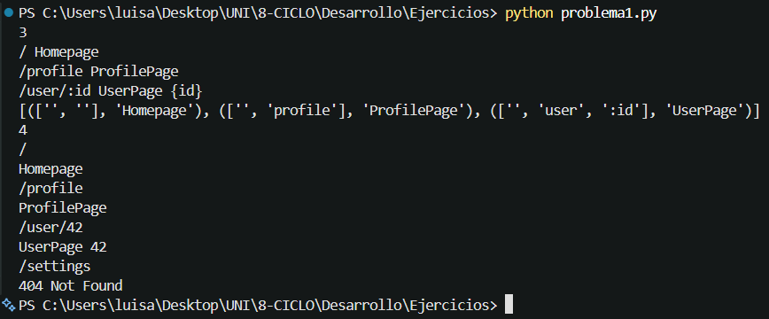
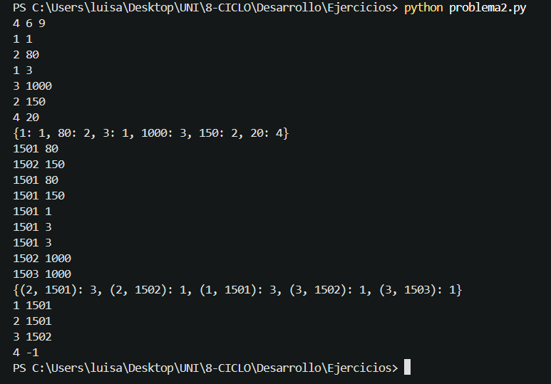

# Informe del Laboratorio (Semana 02)
Luis Andre Trujillo Serva
---
## Código 01

1. Lee cuántas rutas hay (N).
2. Lee cada ruta y la separa en segmentos dividiendo por /.
3. Lee cuántas transiciones hay (M).
4. Para cada transición, la separa en segmentos igual que las rutas.
5. Compara la transición con cada ruta verificando que tengan el mismo número de segmentos.
6. Compara segmento por segmento: si el segmento de la ruta empieza con : es un parámetro y guarda el valor correspondiente de la transición.
7. Si todos los segmentos coinciden, imprime el contenido de esa ruta y el parámetro si existe.
8. Si ninguna ruta coincide, imprime 404 Not Found.

### Pantalla de salida

    

## Código 02

Encuentra al cliente que más compras realizó en los terminales de cada socio.

1. Lee cuántos socios (N), terminales (M) y transacciones (S) hay.
2. Lee cada terminal y guarda a qué socio pertenece.
3. Lee cada compra, identifica el socio dueño del terminal y suma +1 a ese cliente.
4. Para cada socio, busca al cliente con más compras.
5. Si hay empate, elige al cliente con el ID más pequeño.
6. Si no hubo ninguna compra, imprime -1.

### Pantalla de salida

    

