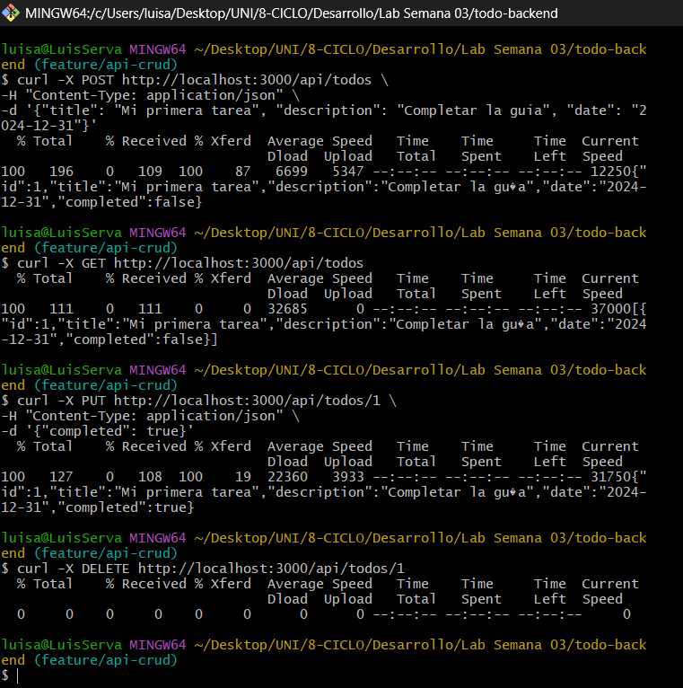
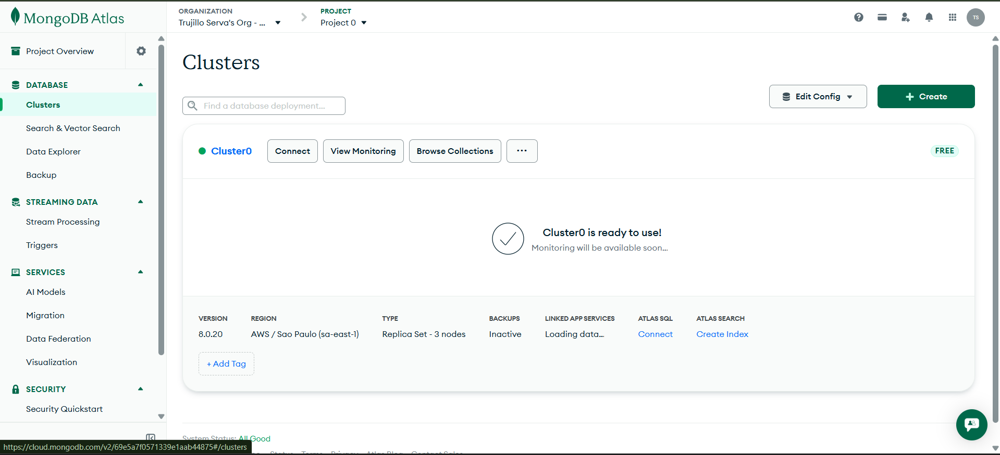
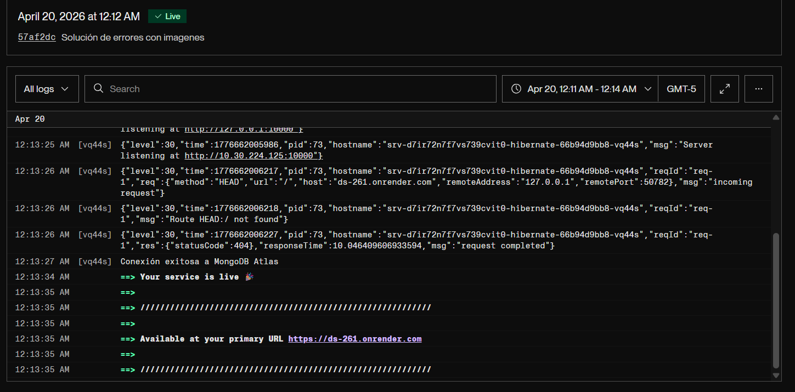
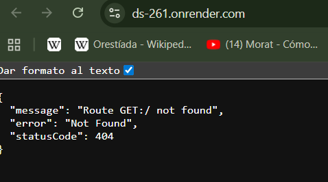

# Laboratorio Semana 03 

## Fase 1: Desarrollo del Backend (Evolución Incremental)

Después de realizar los pasos verificamos el serviedor nativo del código inicial de `server.js`.

    

Luego creamos el cluster en MongoDB.

    

## Fase 2: Despliegue del Backend (Render)

Realizamos las configuraciones para el deploy en Render.

    

Visualizamos el resultado.

    

